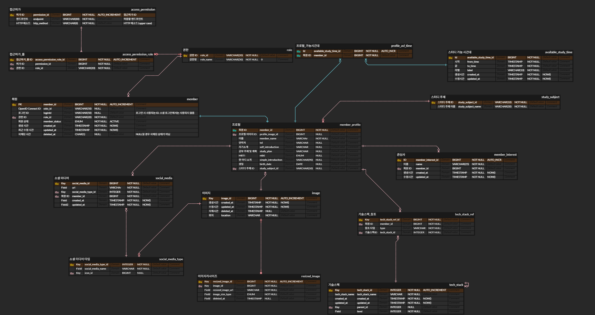

# 안녕하세요!

안녕하세요! 스터디 플랫폼 프로젝트에 백엔드 개발자로 참여하기를 희망하시는 여러분들이 수행하실 리팩토링 과제에서
다루게 될 프로젝트입니다. 저희 팀이 지금까지 개발한 코드 중에 "회원" 컴포넌트만 떼어냈습니다.
여러분께서는 회원 관련 기능들에 대해 리팩토링을 진행해 주시고, 또 추가 기능 구현을 수행해 주시면 감사하겠습니다.

거듭 말씀드리지만, 이 과제는 저희가 여러분의 코딩 스타일, 역량을 파악할 뿐만 아니라 여러분 또한 저희의 수준을
파악하실 수 있는 기회입니다. 프로젝트에 참여하신다고 해서 저희가 월급을 드리는 것도 아니라 과제를
드리는 게 조금 민망하지만, 그래도 서로를 알아간다는 의미에서 이 과제에 참여해 주시면 좋겠습니다!

# 과제 내용

과제 내용은 크게 두 가지입니다. 첫째, 간단한 추가 기능 구현, 둘째, 기존 코드 리팩토링입니다. 저희가 이러한 내용의
과제를 드리는 이유는, 리팩토링 과정에서 여러분의 개발 가치관과 지식을 잘 파악할 수 있다고 생각하기 때문입니다.
처음에는 단순 CRUD 개발 과제를 생각했는데요, 그렇게 한다면 과제를 드리는 저희 입장에서도 요구사항 정의하면서 시간적
비용이 발생하고, 과제를 수행하는 여러분 입장에서도 재미도 없고, 지난하고, 또 저희 프로젝트의 개발 방식을 파악하기
어려울 거라고 생각했습니다. 그래서 차라리 리팩토링 과제를 드리자, 하는 생각에 이러한 과제를 드리게 되었습니다.

그리고 단순히 코드만 드리고 리팩토링을 요청하기만 한다면, 여러분이 방향성을 잡기 어렵겠다는 이야기가 나왔습니다.
추가 기능 구현 과제를 드리면, 기능 구현하면서 기존 코드를 재사용하는 과정에서 개선이 필요한 부분을 보다 수월하게
발견하실 수 있다는 생각에 추가 기능 과제도 요청드리게 되었습니다.

또한 코드 군데군데 TODO를 달아서 리팩토링 지점을 보다 쉽게 찾을 수 있도록 했습니다.

아래 제시된 모든 항목을 충족시키실 필요는 없습니다. 물론 많은 항목이 완료되면 좋겠지만, 꼭 그러지 않더라도
저희와 여러분이 서로를 충분히 알 수 있을 만큼 수행하시면 되겠습니다. 이 과제에 많은 시간을 할애할 수 있는 분이 있는
반면, 회사에 다니고, 야근을 하는 등의 사유 때문에 시간을 많이 투자하기 어려운 분도 있을 수 있으니까요.

과제는 `domain` 패키지 아래에 있는 것만 대상으로 수행하시면 적절하지 않을까 싶습니다. `global` 패키지까지 포함시키면 너무 많을 것 같네요. 쳐낼 거 쳐낸다고 했는데도
코드 라인 수효가 좀 많네요... ㅎㅎ `global` 패키지에 있는 코드들은 한번 읽어만 봐 주세요! 물론 `global` 패키지에 있는 코드에서도 개선 사항이 보여서 리팩토링해 주시면
매우 좋습니다.

## 방향성

저희는 다음과 같은 가치관을 가지고 개발하기를 원합니다.

- 유연하고 확장 가능한 구조
    - 비즈니스 로직이 외부 인프라를 고려하지 않도록
- 관심사 분리
- 성능을 고려한 구현
- 단순함에서 출발하여 지속적으로 개선하기
- 테스트 코드 작성
- 문서를 통한 소통 (API 명세, Javadocs 등)
- 바퀴를 재발명하지 않기
- 의미가 명확하고 예쁜 이름

## 추가 기능 구현

추가 기능 구현 시 **필요한 칼럼이 있으면 추가**하시면 되고, 필요없는 칼럼이 있으면 제거하셔도 좋습니다.

| 제목              | 요구사항                          | 설명                                                                                                                                            |
|-----------------|-------------------------------|-----------------------------------------------------------------------------------------------------------------------------------------------|
| 회원 탈퇴           | 회원은 회원 탈퇴를 수행하기를 원한다.         | 아직 회원 탈퇴 기능이 구현되지 않은 상태입니다. 회원 탈퇴 기능을 완성해 주시면 되겠습니다.                                                                                          |
| 회원 정지           | 관리자는 회원의 계정을 정지시키기를 원한다.      | `MemberStauts`를 활용해 주시면 되겠습니다. 관리자만 해당 기능을 사용할 수 있어야 합니다. 이는 `access_permission`과 `access_permission_role` 테이블과 관련 있습니다.                      |
| 회원 목록 조회        | 관리자는 회원 목록을 조회하기를 원한다.        | Pagination을 적용해야 하고, 페이지 크기 기본값을 설정하되, 클라이언트는 페이지 크기를 조절할 수 있어야 합니다. 목록 아이템은 다음 데이터를 포함해야 합니다: 회원 ID, 이름, 생성시간, 회원 이름, 연락처, 생년월일, 선호하는 스터디 주제 |
| 소셜 미디어 타입 추가    | 관리자는 소셜 미디어 타입을 추가하기를 원한다.    | `SocialMediaType` 엔티티를 참고하시면 되겠습니다.                                                                                                           |
| 소셜 미디어 타입 목록 조회 | 관리자는 소셜 미디어 타입 목록을 조회하기를 원한다. |                                                                                                                                               |
| 소셜 미디어 타입 삭제    | 관리자는 소셜 미디어 타입을 삭제하기를 원한다.    |                                                                                                                                               |

## 우리의 고민

우리 개발팀의 고민을 말씀드리면 좀 더 리팩토링하시기 편하실 것 같네요!

- 서로 다른 도메인끼리 의존할 때, 서비스 레이어에 의존해야 하는가, 레포지토리 레이어에 의존해야 하는가?
- 비즈니스 로직 코드를 JPA에 대한 의존성을 어떻게 하면 아름답게 제거할 수 있을까?
    - 어떻게 하면 Persistence 프레임워크를 JPA에서 MyBatis로 바꾸든, JOOQ로 바꾸든, Spring Data JDBC로 바꾸든, 기존 코드를 건드리지 않고 유연하게 바꿀 수 있을까?
- `@ManyToMany`을 사용해도 괜찮을까?
- 로그를 어떻게 남기면 좋을까?
- Authorization 헤더에 담겨서 전달되는 Bearer 토큰에서 회원ID를 추출할 수 있다. 어떤 회원이 자신이 소유하고 있는 리소스 (예를 들어 회원이 작성한 게시글 등)에 대한 Operation을
  수행하는 API에서 회원ID는 URI에 나타내야 할까, 아니면 URI에는 나타내지 않고 Bearer 토큰에서 회원ID를 꺼내서 사용해야 할까?
- DDL을 SCM에서 관리해도 괜찮을까?
- Springdoc을 활용하여 Swagger UI를 자동화하고 있다. 그러나 Example Parameter나 Example Response는 수동으로 작성해야 한다 (자동화하는 방법이 있을지도 모르지만, 아직 그
  방법을 찾지 못했다). API 수정이 발생할 때마다 Example도 같이 수정해 주어야 하는데, Example을 유지할 필요가 있을까? 아니면 Example을 자동화할 필요가 있을까? (
  Springdoc의 `@ExampleObject`)
- 이미지 파일 확장자를 `enum`으로 그 종류를 제약하고 있는데, 그럴 필요가 있을까?
- 이미지 파일명을 백엔드 서버에서 UUID와 Unix Time을 조합하여 생성해 주고 있다. 이 방법이 이미지 파일명의 유일성을 반드시 보증하는가? 다른 방법이 없을까?
- Repository 객체가 비즈니스 로직을 가지지 않고 데이터를 가져오는 역할에만 국한시키려면 어떻게 해야 할까?
    - 현재 회원 객체에 대해서 soft delete를 정책을 채택했다. 삭제되지 않은 회원을 가져오는 Repository 객체 API는 다음 두 개 중 어떤 형태를 가지는 것이 올바를까?
        1) `findNotDeletedByMemberId(Long memberId)`
        2) `findByMemberIdAndDeleted(Long memberId, boolean deleted)`
- 각 엔드포인트에 대한 접근 권한을 테이블로 관리하고 있는데, 테이블로 관리하는 방법과 Java 코드로 관리하는 방법 중 어떤 것이 올바를까?
- 테스트 코드의 길이를 현격하게 증가시키는 Given 데이터 삽입 코드를 어떻게 해소할 수 있을까?
- `@BeforeEach`에는 어떤 코드가 올 수 있고 어떤 코드가 올 수 없을까?
- Composite key를 사용할 것인가?

# 프로젝트 설명

과제를 수행하실 때 도움이 되도록, 저희 프로젝트 코드를 간략하게 설명드리겠습니다.

## 프로젝트 소개

저희 프로젝트는 참여자들이 둘씩 짝지어 조를 이루고 서로 번갈아가면서 면접자와 피면접자의 역할을 수행하며 면접을 통해 공부한 것들을 복습하는 방식의
스터디를 플랫폼화하는 프로젝트입니다. 기존에 오픈 카카오톡과 노션을 기반으로 진행되던 스터디를 우리가 만든 플랫폼에서 진행할 수 있도록 하는 것이
우리 프로젝트의 목적입니다.

## 서브도메인

이 과제 프로젝트에 포함된 서브도메인은 다음과 같습니다.

- 회원 (`member`)
    - 인증/인가 (`auth`)
    - 회원 (`member`)
    - 회원 프로필 (`member profile`)
- 이미지 (`image`)
- 카테고리 (`category`)
    - 기술스택 (`tech stack`)

### 부가설명

- `StudySubject`: 스터디 주제입니다. 회원이 관심을 가지고 또 스터디하려는 주제를 일컫습니다. 지금은 CS, 백엔드, 프론트엔드 세 가지 주제가 있습니다. 회원은 이 세 가지 주제 중 하나를 선택할 수
  있습니다.
- `MemberInterest`: 회원의 관심사입니다. 회원이 임의로 자신의 관심사를 입력하여 등록할 수 있습니다.
- `AvailableStudyTime`: 스터디 가능 시간대입니다. 각 스터디 참여자들이 면접을 진행할 수 있는 시간대를 말합니다. 현재는 6가지의 스터디 가능 시간대가 있습니다. `base_record.sql`에
  정의된 `available_study_time` INSERT문을 보시면 잘 이해가 되시리라 생각합니다.
- `SocialMedia`: 회원은 자신의 GitHub, 혹은 블로그 등의 소셜 미디어 링크를 다른 사람들과 공유할 수 있습니다. `SocialMedia`는 각 회원이 서비스에 표시한 자신의 SNS 링크를
  나타냅니다.

## 환경 세팅

### JDK

- Java 21
- Amazon Corretto
- Amazon Corretto를 채택한 이유
    - AWS에 배포를 진행하기 때문에 AWS에서 장기 업데이트 지원을 제공해 주는 Amazon Corretto 배포판을 채택

  [Amazon Corretto FAQ](https://aws.amazon.com/ko/corretto/faqs/)

### Container Images

#### JDK

- amazoncorreto:21

#### Database

- mariadb:10.11
- MariaDB를 Docker로 실행하기

  `docker run --name ${설정하고 싶은 컨테이너 이름} -d -p 3306:3306 -e MARIADB_ROOT_PASSWORD=${루트 유저 패스워드} -e MARIADB_DATABASE=${데이터베이스 이름} -e MARIADB_USER=${유저 이름} -e MARIADB_PASSWORD=${루트가 아닌 유저의 패스워드} mariadb:10.11`

  볼륨/바인드 마운트를 활용해 컨테이너 내부 /docker-entrypoint-initdb.d 경로에 초기화 DDL 스크립트를 위치시킴으로써 컨테이너 생성 시점에 데이터베이스를 초기화할 수 있습니다.

데이터베이스 생성 후, DDL문을 실행하여 테이블을 생성하시고, `base_record.sql`을 실행하여 기본 데이터를 넣어 줍니다.

### Environment Variable

환경변수는 Spring configuration 파일의 property에 대입됩니다 (`application.yml`). 환경변수가 세팅돼 있지 않더라도 기본값이 세팅돼 있기 때문에
환경변수가 없더라도 애플리케이션은 정상 작동됩니다.

| Name                     | 설명                                                                                                                                                                                                              | Example value                                                                                                                                  | Required on profile (v2 추가) | Default (v2 추가)                                                                                                                |
|--------------------------|-----------------------------------------------------------------------------------------------------------------------------------------------------------------------------------------------------------------|------------------------------------------------------------------------------------------------------------------------------------------------|-----------------------------|--------------------------------------------------------------------------------------------------------------------------------|
| `DB_URL`                 | 사용할 데이터베이스의 URL입니다. 오른쪽 Example value에서 `localhost`와 `zto_local_core` 부분을 적절하게 바꾸시면 됩니다.                                                                                                                        | (로컬 DB를 사용할 경우) `jdbc:mariadb://localhost:3306/zto_local_core?createDatabaseIfNotExist=true&serverTimezone=Asia/Seoul&characterEncoding=UTF-8` |                             | `jdbc:mariadb://localhost:3306/zto_local_core?createDatabaseIfNotExist=true&serverTimezone=Asia/Seoul&characterEncoding=UTF-8` |
| `DB_USERNAME`            | 데이터베이스 유저의 아이디입니다.                                                                                                                                                                                              | `user`                                                                                                                                         |                             | `root`                                                                                                                         |
| `DB_PASSWORD`            | 데이터베이스 유저의 비밀번호입니다.                                                                                                                                                                                             | `secret`                                                                                                                                       |                             | `root`                                                                                                                         |
| `GOOGLE_CLIENT_ID`       | 구글 로그인용 Client ID입니다.                                                                                                                                                                                           |                                                                                                                                                | qa.test, prod               |                                                                                                                                |
| `GOOGLE_CLIENT_SECRET`   | 구글 로그인용 Client Secret입니다.                                                                                                                                                                                       |                                                                                                                                                | qa.test, prod               |                                                                                                                                |
| `KAKAO_CLIENT_ID`        | 카카오 로그인용 Client ID입니다.                                                                                                                                                                                          |                                                                                                                                                | qa.test, prod               |                                                                                                                                |
| `SERVER_ORIGIN`          | 백엔드 서버의 오리진입니다. scheme, domain, port를 모두 포함한 값입니다.                                                                                                                                                              | `http://localhost:8080`                                                                                                                        |                             | `http://localhost:8080`                                                                                                        |
| `CLIENT_ORIGIN`          | 클라이언트 서버의 오리진입니다. 소셜 로그인 시 프론트 페이지로 리다이렉션 등의 상황에서 사용되는 변수입니다. 프론트 서버가 localhost에서 3000번 포트에서 돌아가고 있다면 `CLIENT_ORIGIN` 값은 `http://localhost:3000`이 됩니다.                                                          | `http://localhost:3000`                                                                                                                        |                             | `http://localhost:3000`                                                                                                        |
| `CLIENT_DOMAIN`          | 클라이언트 서버의 도메인입니다. 쿠키의 도메인 값을 세팅하기 위해 필요한 변수입니다. 프론트엔드 서버가 localhost에서 돌아가고 있다면, `CLIENT_DOMAIN`의 값은 `localhost`가 됩니다. 프론트엔드 서버가 `test.zeroone.it.kr:3000`에서 돌아가고 있다면, `CLIENT_DOMAIN`의 값은 `zeroone.it.kr`이 됩니다. | `localhost`                                                                                                                                    |                             | `localhost`                                                                                                                    |
| `SPRING_PROFILES_ACTIVE` | 활성화할 Spring Profile을 명시한 환경변수입니다.                                                                                                                                                                               | `qa.test`                                                                                                                                      |                             | `default`                                                                                                                      |
| `STATIC_RESOURCE_PATH`   | 프로필 이미지 등을 업로드할 때 사용됩니다. `none`일 경우, 정적 콘텐츠 업로드 시 classpath:/static 아래에 콘텐츠가 저장됩니다.                                                                                                                             | `/app/app-resource`                                                                                                                            |                             | `none`                                                                                                                         |

## 문서 일람

- [OAuth 2.0 가이드](docs/oauth2/oauth2-guide.md)
- [기본 데이터](docs/base-record/base-record.md)
- [에러 코드 가이드](docs/error-code/error-code-guide.md)
- [공통 응답 형식](docs/common-response.md)
- [Git 컨벤션](docs/git-convention/git-convention.md)
- [코딩 컨벤션](docs/coding-convention/coding-convention.md)
- [요청을 보낸 회원 ID 가져오기](docs/extract-member-id/extract-member-id.md)
- [엔드포인트 권한 등록](docs/endpoint-authorization/endpoint-authorization.md)
- [Spring Profiles](docs/spring-profile.md)

## Auth

인증/인가 기능은 `no-auth` Profile을 활성화함으로써 끌 수 있습니다.

인증/인가 기능을 사용한다면 접근이 제한된 엔드포인트에 접근할 때 `Authorization` 헤더에 Bearer 토큰을 넣어야 합니다. Postman을 사용하시는 게 편할 겁니다.
`qa.test`, `prod` Profile을 활성화하지 않는다면 JSON 토큰을 사용하게 됩니다. 저희 프로젝트 사정상 OAuth 2.0 API 키를 제공해 드리기 어려울 듯합니다.
따라서 **과제를 수행할 때는 JSON 토큰을 사용해 주세요**. JSON 토큰을 사용하는 방법은 간단합니다.
포스트맨 등을 사용할 때, `Authorization` 헤더에 `{"id": "123"}` 이런 식으로 JSON 형식의 값을 수동으로 넣으면 됩니다. 이때, JSON 토큰의 `id` 프로퍼티는 `memberId`가
아닌
`oidcId`여야 합니다. `oidcId`에 대해서는 아래 ERD 섹션에서 `member` 테이블에 대한 설명을 참고해 주세요. 혹은 OAuth 2.0 가이드 문서를 보시면 되겠습니다.
OAuth 2.0 가이드 문서에 JSON 토큰에 대한 설명도 나와 있습니다.

혹은, 임의로 카카오 로그인 혹은 구글 로그인 API 키를 발급받아 사용하실 수 있습니다. API 키를 따로 발급받으면 해당 API 키를 환경변수에 세팅하시고 (환경변수에 대한 설명은 위에 나타난
설명을 참고해 주세요) Spring Profile 중 `qa.test` 혹은 `prod`를 활성화해 주세요. 웬만하면 `qa.test`를 활성화해 주시길 바랍니다 (`prod`는 아직 검증이 부족합니다).

## ERD

헷갈릴 수 있는 테이블과 칼럼만 취사선택해서 설명하겠습니다.

### `member`

회원 정보를 가지고 있는 테이블입니다.

- `oidc_id`
    - 소셜 로그인을 할 경우 의미가 있습니다.
    - OAuth 2.0 Authorization 서버에서 제공하는 회원 고유값입니다.
- `login_id`
    - 저희 서비스 자체 로그인 기능에서 유효한 칼럼입니다.
    - 지금 저희 서비스는 자체 로그인이 없으므로, 지금은 의미 없는 칼럼입니다.
- `deleted_at`
    - 회원이 삭제된 시간입니다.
    - `deleted_at`이 `NULL`일 경우, 삭제되지 않은 회원을 의미합니다.

### `access_permission`

접근허가 테이블입니다. 모든 요청에 대해 접근을 허가하고자 하는 엔드포인트와 HTTP 메소드는 이 테이블에 추가하지 않으면 됩니다.

- `endpoint`
    - 접근허가를 정의할 엔드포인트입니다.
- `http_method`
    - HTTP 메소드입니다.
    - `GET`, `POST`, `PATCH`, `PUT`, `DELETE`, ...

### `access_permission_role`

`access_permission` 테이블과 `role` 테이블의 연관 테이블입니다.

### `member_profile`

회원 프로필 테이블입니다. 회원 테이블과 역할이 조금 다릅니다. 회원 테이블이 회원의 권한, 로그인 정보 등의 데이터를 담는다면,
회원 프로필 테이블은 프로필 이미지, 자기소개, 연락처, 이름 등 회원 프로필 데이터를 가지고 있습니다.

- `member_id`
    - `member` 테이블을 참조하는 FK이자, `member_profile` 테이블의 PK입니다. `member_profile` 테이블과 `member` 테이블은 식별 관계입니다.

### `available_study_time`

스터디 가능 시간대입니다. 현재 총 6개의 시간대가 있고, 회원들은 6개의 시간대 중 가능한 시간대를 고를 수 있습니다. 따라서 `member_profile`
테이블과 다대다 관계를 맺습니다.

- `label`
    - "오전", "오후", "저녁", "심야" 등 각 시간대의 레이블입니다.

### `member_interest`

회원의 관심사입니다. 관심사는 회원이 직접 입력할 수 있습니다.

### `social_media`

회원의 SNS, 블로그 등 소셜 미디어입니다. 한 명의 회원은 블로그나 SNS, GitHub 등 여러 개의 소셜 미디어 링크를 등록할 수 있습니다.

### `social_media_type`

회원이 등록한 소셜 미디어의 종류입니다. GitHub, 블로그/SNS 등이 있을 수 있습니다.

### `image`

이미지 테이블입니다. 실제 이미지가 저장된 경로를 저장하지 않고, 실제 이미지 경로는 `resized_image` 테이블에 담겨 있습니다.

- `location`
    - 이미지가 저장된 위치입니다. 이미지 경로가 아닌, 이미지가 저장된 서버 도메인이 담길 수 있습니다.
    - ex) `http://localhost:8080`, `https://aws.s3.com` (S3 경로가 어떤 식이었는지 기억 안 나네요), `sftp://some.fileserver.com`
    - 각 값은 `/`로 끝나지 않습니다.

### `resized_image`

리사이징 이미지입니다. 현재는 이미지 리사이징이 구현되지 않았고, 원본 이미지를 그대로 저장합니다.

- `image_size_type`
    - 이미지 사이즈의 타입을 말합니다. 이미지 크기, 이미지 비율 등에 따라 여러 개 이미지 사이즈 타입이 있을 수 있습니다.
    - 아직 이미지 리사이징이 구현되지 않은 상태이기 때문에, `ORIGINAL` 값만 갖습니다.

# 맺음말

화이팅! 즐겁게 합시다 :)
