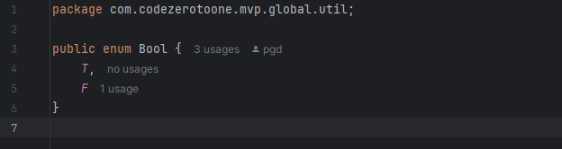
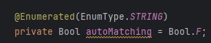
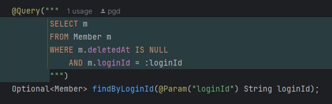
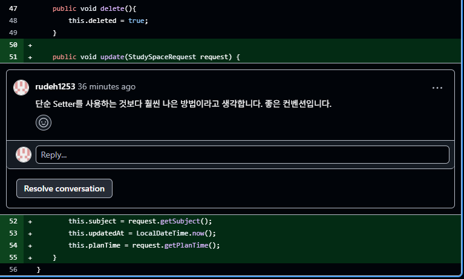
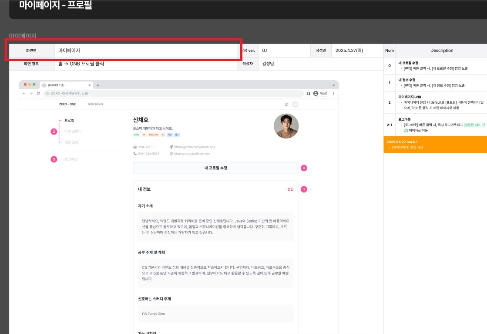
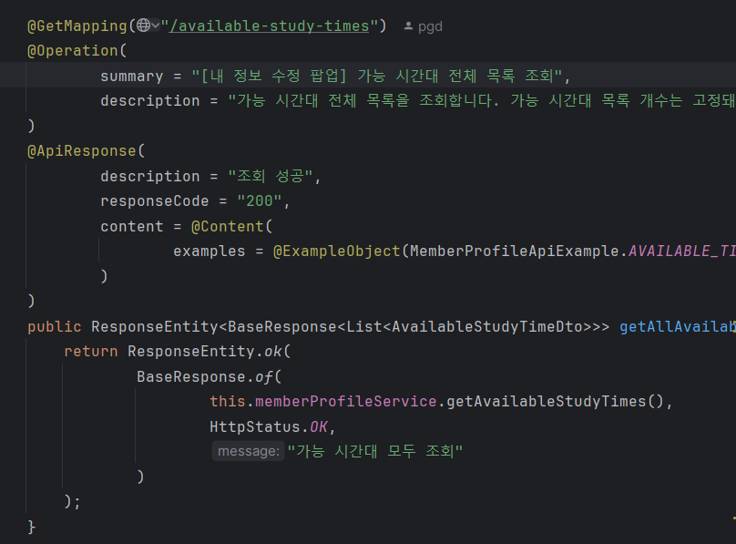

# 코딩 컨벤션

Description: 코딩 컨벤션
Tag: 컨벤션
Writer: PGD

# 버전 히스토리

| 버전 | 업데이트일시 (KST) | 설명 |
| --- | --- | --- |
| v1 | 2025-04-26 12:26 | 히스토리 기록 시작 |
| v2 | 2025-05-06 21:10 | Springdocs 컨벤션 추가 |

# 기본 코딩 컨벤션

기본 코딩 컨벤션은 기본적으로 다음을 따릅니다.

[Google Java Style Guide](https://google.github.io/styleguide/javaguide.html)

## 첨언

- Javadocs는 필수는 아니지만 권장 사항입니다.
    - private 메소드/필드에 대한 주석은 코드를 이해하는 데 도움이 될 경우 달아 줍니다.
- 각 유닛 테스트에 `@DisplayName`은 꼭 달아 주세요

# 패키지 컨벤션

프로젝트 root 패키지 (`com.codezerotoone.mvp`)에는 두 가지 패키지만 존재합니다. - `domain`, `global`

- `domain`: 도메인에 관련된 코드를 모아 둡니다. 외부 의존성은 최대한 배제합니다.
    - 예외적으로 `domain` 패키지 내 JPA에 대한 의존성은 개발 편의성을 위해 허용합니다.
- `global`:

## `domain` 패키지

- `domain` 패키지 안에는 도메인의 각 컴포넌트를 구현한 소스코드가 포함돼 있습니다. 컴포넌트에는 서브 컴포넌트가 존재할 수 있습니다.
    - e.g.) `domain.member` 패키지 안에 `domain.member.member`, `domain.member.profile`, `domain.member.auth` 패키지가 존재할 수 있습니다.
- 외부 의존성은 최대한 배제합니다.
    - 예외적으로 JPA에 대한 의존성은 개발 편의성을 위해 허용합니다.
- 각 컴포넌트는 기본적으로 다음 패키지로 구성됩니다.
    - `controller`: 컨트롤러 패키지
    - `service`: 서비스 패키지
    - `dto`: DTO 객체를 모아 놓은 패키지. 웹 기반 애플리케이션 간의 통신 인터페이스를 정의한 DTO 객체를 모아 놓습니다. `request`, `response` 패키지를 서브 패키지로 둘 수 있으며, `request`나 `response`에 상관 없이 사용되는 DTO 객체는 `dto` 패키지 바로 아래 위치합니다. 주로 서비스 객체에서 반환합니다.
        - DTO 객체가 웹 통신 인터페이스 외의 다른 용도로 사용될 경우, DTO 객체는 다른 패키지에 위치할 수 있습니다. (예를 들어, `repository` 패키지 아래 DTO 객체가 존재할 수 있으며, SQL 쿼리에 대한 파라미터를 담은 DTO 객체 혹은 Projection 연산의 결과값을 담은 DTO 객체가 있을 수 있습니다.
    - `repository`: Repository 객체를 모아 놓은 패키지
    - `entity`: 엔티티 객체를 모아 놓은 패키지. entity 객체는 JPA에 의존성을 지닌 객체이기 때문에 `infrastructure` 패키지에 분리하는 것이 더 좋은 설계일 수 있지만 (헥사고날 아키텍처), 저희는 3 Layer Architecture 기반으로 개발을 진행하면서 개발 편의성을 위해 entity 객체를 도메인 객체처럼 사용합니다.
        - entity 객체 자체는 순수 도메인 객체가 아닌 JPA entity 객체이지만, 외부에서 entity 객체를 사용할 때는 최대한 순수 도메인 객체를 사용하는 것처럼 사용해 주시면 좋겠습니다.

## `global` 패키지

여러 컴포넌트에서 사용될 수 있는 컴포넌트를 모아 놓은 패키지입니다. 외부 의존성을 포함할 수 있습니다. 다음과 같은 요소들로 구성될 수 있습니다.

- 유틸 클래스
- 파일 업로드/다운로드 처리
- Spring Security 기반 인증/인가 로직
- Spring 설정 파일
- 기본 API 포맷

# 네이밍 컨벤션

## Repository

### Repository에서 CRUD 연산에 대해 다음과 같은 접두사 (prefix)를 붙입니다.

- **조회**: find~By~
    - e.g.) `findById`, `findEmailByMemberId`
- **삽입**: save~
    - e.g.) `save`, `saveEmail`, `saveMember`
- **수정**: update~
    - e.g.) `updateById`, `updateMemberByMemberId`
- **삭제**: delete~
    - e.g.) `deleteById`, `deleteMemberByMemberId`

### Repository에 사용 기술을 포함시키지 않습니다.

- `MemberRepository` ( o )
- `MemberJpaRepository` ( x )
- `MyBatisMemberRepository` (x)
- `MemberMapper` (x) (MyBatis 종속적 이름)

이는 Service 레이어에서 의존하고 있는 Repository일 경우 적용되는 컨벤션입니다. Repository 레이어에서는 `MemberJpaRepository`, `MemberMapper`와 같은 특정 기술 종족적 Repository 객체에 의존할 수 있습니다.

다음과 같은 코드가 허용된다는 말입니다.

```java
@Repository
@RequiredArgsConstructor
public class MemberRepository {
    private final MemberJpaRepository;
    private final MyBatisMemberRepository;
}

```

## Service

Service 객체는 기본적으로 Repository CRUD 연산의 네이밍 컨벤션을 따르지만, CRUD 연산 외의 비즈니스 로직의 경우, 그 로직을 잘 표현할 수 있는 이름으로 짓습니다.

## Controller

Controller의 메소드명은 알잘딱

## `~Impl` 대신 `Default~`

하나의 인터페이스에 대해 하나의 구현체만 존재할 경우, ~Impl이라는 접미사를 붙이는 것이 전통적인 개발 방식입니다 (`MemberService` - `MemberServiceImpl`). 그러나 ~Impl이라는 접미사는 해당 인터페이스에 대해 오직 하나의 구현체만 존재한다는 의미를 시사합니다. 어떤 인터페이스에 대해 하나의 구현체만 존재한다는 사실은 Java 인터페이스의 존재 의의인 다형성 측면에서 전혀 의미가 없습니다. 하나의 구현체만 두느니, 차라리 인터페이스를 정의하지 않는 편이 낫습니다.

"Default~"라는 접두사가 의미하는 바는 이와 다릅니다. 구현체 이름의 접두사로 "Default~"가 붙을 경우, 해당 구현체는 기본적으로 적용되는 인터페이스이며, 나중에 새로운 구현체가 추가될 수 있다는 점을 암시합니다. 그래서 "Default~" 접두사를 사용할 경우 의미상 객체지향의 다형성이 지켜집니다.

그래서 Java 인터페이스에 대해 하나의 구현체만 존재할 경우, `~Impl` 접미사 대신 `Default~` 접두사를 사용하는 것을 권장합니다. (e.g. `MemberService` - `DefaultMemberService`)

다만 아예 인터페이스를 정의하지 않는 것도 허용합니다.

# JPA

## Entity의 Boolean 사용에 대해

특정 데이터베이스에 대한 종속성을 해소하기 위해 Entity에서는 boolean 타입을 사용하지 않습니다. 대신 따로 정의한 `Bool` enum을 사용합니다. `Bool` enum은 `com.codezerotoone.mvp.global.util` 패키지에 있습니다.



`Bool`을 사용할 때, `@Enumerated(EnumType.STRING)`을 지정해 줍시다.



## Soft Delete

저희 서비스에서는 Soft delete를 주로 사용합니다. Soft delete를 사용하는 부분에서, 해당 레코드가 삭제됐는지 여부는 `deletedAt`으로 판단합니다.

`deletedAt`은 해당 엔티티가 삭제된 시간을 기록합니다. `deletedAt`이 `null`이면 엔티티가 아직 삭제되지 않은 것이고, `null`이 아니면 엔티티가 삭제된 것입니다. 그래서 쿼리에서 `deletedAt`이 `null`인지를 체크해 주어야 합니다.



## `BaseEntity`

생성 시간, 수정 시간을 기록하는 엔티티의 경우, `BaseEntity`를 상속하도록 합니다.

## Setter

Setter 사용을 지양합니다. 엔티티 내부의 상태를 변경해야 할 경우, 단순 Setter를 사용하기보다 의미 있는 메소드를 정의해서 사용합니다.



PR에서 캡쳐해 왔습니다.

## 연관관계 로딩

기본적으로 지연 로딩 (`FetchType.LAZY`)을 사용하고, 필요한 부분에서만 즉시 로딩 (`FetchType.EAGER`)을 사용합니다. `@OneToOne`, `@ManyToOne` 같은 경우 기본값이 `FetchType.EAGER`이기 때문에 `FetchType.LAZY`로 지정해 주어야 합니다.

# Springdocs 컨벤션

저희는 Springdocs를 활용해 REST API 문서를 작성합니다. 화면에 필요한 데이터를 전송하는 REST API의 경우, `summary`에 관련된 화면 이름을 붙여 줍시다.



Figma 기획 문서에서 화면명을 확인할 수 있습니다. 형식은 `[화면명] 요약 설명`입니다.

예시)



아직 구현되지 않은 API일 경우, 앞에 `[미구현]`을 붙여 줍시다.


- Comment
    - BE_유찬주: setter를 안쓴다는건 좀 제가 잘 이해가 안가는데 저거 저렇게 쓰는건 나중에 DTO중에 한개만 수정해서 다시 밀어넣는경우 그런게 있을껀데 다 일일히 다시 저렇게 매핑한다는게 오히려 더 리소스 낭비 아닐까 싶은데 혹시 제가 잘못 이해하고 있는걸까요??
    - BE_유찬주: 캡슐화가 비효율적이라는건 뭐 많이 이야기 나오긴 하지만 제가 다닌곳에서는 세터 안쓴데가 없다보니 임플리먼츠 나 이런건 그럴수 있는데 좀더 다른 개발하는데에서는 어떤지 확인이 가능하실까요
    - BE_박경도: 객체의 불변성을 지키기 위해 Setter 사용을 지양하고자 합니다. 제가 이전에 수행했던 프로젝트에서는 Setter 사용을 지양함으로써 객체의 불변성을 최대한 지킬 수 있었습니다.
    다만 도메인 객체는 내부 상태가 변하는 상황이 발생할 수밖에 없는데, 단순 Setter를 사용하면 어떤 비즈니스 로직 상황에서 어떤 Setter가 호출되어야 하는지, 그리고 사용 의도가 명확하지 않다는 문제점이 있습니다.
    개발 시 효율성 면에서는 Setter를 사용하는 게 더욱 효율적이겠지만, 유지보수성 측면에서는 Setter 사용을 지양하고, 객체 내부 상태를 변경할 때는 도메인 로직상 의미 있는 메소드를 따로 정의하는 편이 더 좋다고 생각합니다.
    [https://smallpig.tistory.com/103](https://smallpig.tistory.com/103)
    - BE_유찬주: 그러면 엔티디 상황별로 케이스를 구체적으로 작성 부탁드립니다.
    insert update delete
    insert into selete
    multiInsert