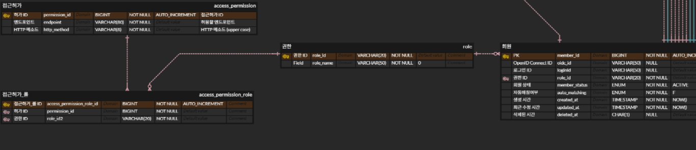

# 엔드포인트 권한 등록

Description: 각 엔드포인트에 대한 권한을 등록하는 방법을 정리
Tag: 권한
Writer: PGD

# 버전 히스토리

| 버전 | 업데이트일시 (KST) | 설명 |
| --- | --- | --- |
| v1 | 2025-05-24 10:41 | 문서 생성 |

# 개요

각 엔드포인트마다 사용자 role에 따른 접근허용 여부를 설정하는 방법을 기술합니다.

# 엔드포인트 접근권한 ERD

특정 엔드포인트에 대한 접근권한을 정의하는 테이블은 ERD에 다음과 같습니다.

- `role` 테이블은 권한 목록을 가집니다.
    - 다음과 같은 레코드를 가질 수 있습니다.
        - `ROLE_MEMBER`
        - `ROLE_ADMIN`
        - `ROLE_GUEST`
- `access_permission` 테이블은 특정 엔드포인트에 대한 접근권한을 표현합니다.
    - 엔티티는 접근을 제한할 엔드포인트와 HTTP 메소드를 가집니다.
    - `access_permission_role` 테이블에서 `access_permission` 테이블에 정의된 각 엔드포인트에 대한 접근권한을 정의합니다. `access_permission`의 레코드가 나타내는 특정 엔드포인트와 HTTP 메소드에 대한 접근은 `access_permission_role` 테이블에서 매핑하고 있는 `role`에 대해서만 허용됩니다.
    - **`*access_permission`에 존재하지 않는 엔드포인트와 HTTP 메소드에 대한 모든 접근은 허용됩니다**.*

### 예시

- `role` 테이블

| `role_id` | `role_name` |
| --- | --- |
| ROLE_MEMBER | Member |
| ROLE_ADMIN | Admin |
| ROLE_GUEST | Guest |
- `access_permission` 테이블

| `permission_id` | `endpoint` | `http_method` |
| --- | --- | --- |
| 1 | /api/v1/members | POST |
| 2 | /api/v1/members | GET |
- `access_permission_role` 테이블

| `access_permission_role_id` | `permission_id` | `role_id` |
| --- | --- | --- |
| 1 | 1 | `ROLE_MEMBER` |
| 2 | 1 | `ROLE_ADMIN` |
| 3 | 2 | `ROLE_ADMIN` |

`role`, `access_permission`, `access_permission_role` 테이블에 위와 같이 레코드가 들어 있다고 가정합니다. `access_permission` 테이블에는 `/api/v1/members` 엔드포인트에 대해 POST 메소드와 GET 메소드 두 가지가 정의되어 있습니다. `access_permission_role` 테이블에서 각 엔드포인트/HTTP 메소드 쌍에 대해 접근이 허용되는 `role`을 매핑하고 있습니다.

(`/api/v1/members`, POST) 쌍에 대해서는 `access_permission_role` 테이블에서 `ROLE_MEMBER`와 `ROLE_ADMIN` 두 `role`에 대해 접근이 허용되고 있습니다. `POST /api/v1/members` 요청은 `ROLE_MEMBER`와 `ROLE_ADMIN`에 대해서는 허용되지만 `ROLE_GUEST`에게는 허용되지 않습니다 (403 - Forbbiden).

(`/api/v1/members`, GET) 쌍에 대해서는 `ROLE_ADMIN`의 접근만 허용되고 있습니다. `GET /api/v1/members` 요청은 `ROLE_MEMBER`, `ROLE_GUEST`에게는 허용되지 않습니다.
