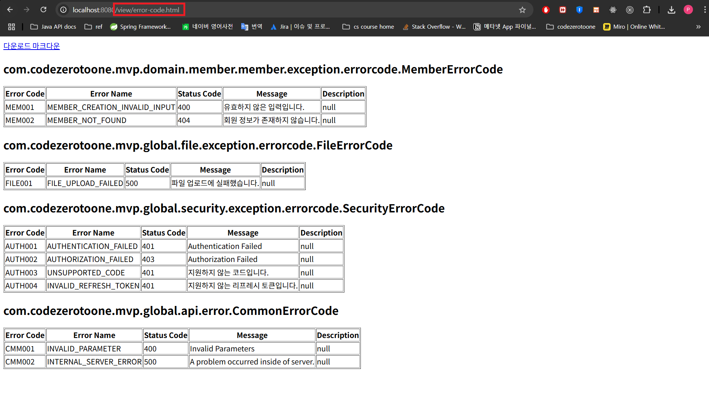
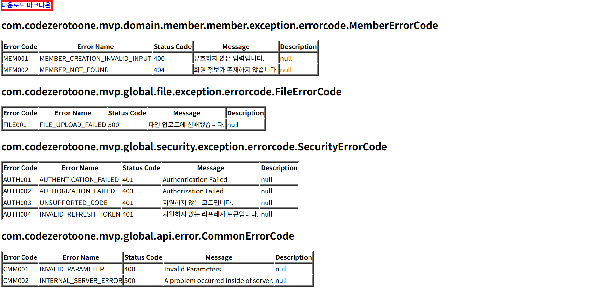
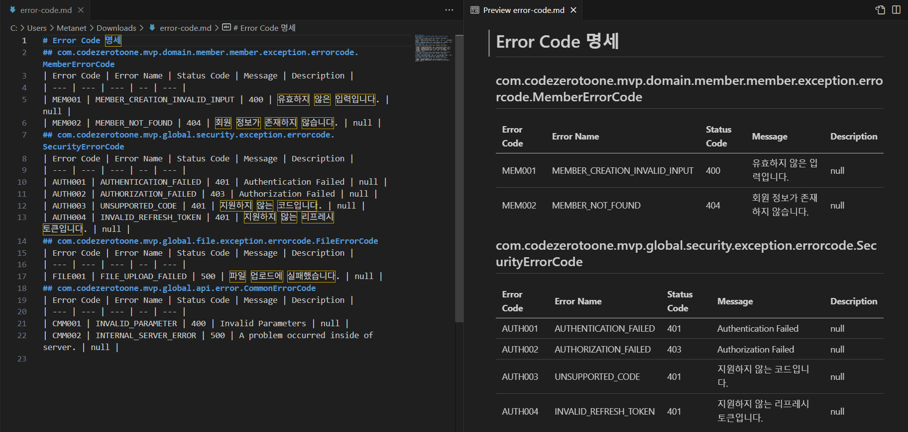

# 에러 코드 가이드

Description: 에러코드를 정의한 enum 클래스를 작성하는 법을 서술합니다.
Tag: API
Writer: PGD

# 버전 히스토리

| 버전 | 업데이트일시 (KST) | 설명 |
| --- | --- | --- |
| v1 | 2025-06-03 19:27 | 문서 생성 |

# 개요

현재 우리 프로젝트에서는 에러 코드를 `enum`으로 관리합니다. 에러 코드를 `enum`으로 관리하기 위한 편의기능을 구현했으며, 여기서 이를 설명합니다.

## 에러 코드의 필요성

HTTP 통신을 사용한다면 클라이언트의 요청이 성공했는지 실패했는지, 실패했다면 어떤 원인에 의해 실패했는지 HTTP Status Code를 통해 알 수 있습니다. 그러나 HTTP는 보편적으로 사용되는 프로토콜로서, 우리 서비스의 상황을 반영하지 않습니다. 그래서 우리 도메인의 용어를 사용한 에러코드가 필요합니다.

# 에러코드 구성 및 명명 규칙

에러코드는 네 가지 구성요소를 가지고 있으며, 각각 명명 규칙은 다음과 같습니다.

- 코드명 (Required)
    - 에러코드는 일정한 포맷을 가지고 있는 코드명에 의해 식별됩니다.
    - 명명 규칙: (에러가 속한 영역을 나타내는 약어, 영문 대문자 3~5자) + (세 자리 숫자)
    - ex)
        - `MEM001` (회원 영역 에러 코드)
        - `CMM001` (공통 에러 코드)
- 에러 이름 (Required)
    - 에러 이름은 자바의 상수 명명 규칙을 따릅니다. 언더스코어 (`_`)를 구분자로 가지는 uppercase로 구성됩니다.
    - ex)
        - `MEMBER_NOT_FOUND`
- 메시지 (Required)
    - 해당 에러의 메시지입니다. 자유 형식으로 기술하면 됩니다.
- Status Code (Required)
    - HTTP Status Code 규칙을 따릅니다.
    - ErrorResponse의 Body에 Status Code가 필요한 이유는 다음과 같습니다.
        - 클라이언트에서 HTTP Status Code를 확인할 수 없을 때 (근데 사실 이건 딱히 상관 없음)
        - 통신 프로토콜이 HTTP가 아닐 때 (중요)
            - 예를 들어 WebSocket을 통한 통신을 할 경우, WebSocket Handshake는 HTTP를 기반이로 이루어지지만 Handshake를 통해 연결이 성립된 이후에는 HTTP가 아닌 프로토콜이 사용됩니다. WebSocket을 통해 교환되는 메시지에는 HTTP Status Code가 포함되지 않기 때문에, Response Payload에 Status Code를 담아야 합니다.
            - 클라이언트가 HTTP Status와 관련지어 에러 상황을 파악할 수 있습니다.
- Description (Option)
    - 에러 코드 설명

## 에러 코드 보기

에러 코드 일람을 따로 정리해 두진 않습니다. 대신 `/view/error-code.html` 경로로 가면 에러 코드 일람을 조회할 수 있습니다. (지금은 디자인 하나 없는 플레인 HTML로만 구성된 페이지지만 나중에 좀 더 예쁘게 바꾸겠습니다. 혹은 프론트엔드 분들이 퍼블리싱해 주신다면…. 근데 사실 안 예뻐도 괜찮지 않을까요?)



아래 나타난 “다운로드 마크다운” 버튼 (사실 a 태그임)을 클릭하면 마크다운 문서를 다운로드받을 수 있습니다.



다운로드받은 마크다운 문서는 아래와 같이 나타납니다.



# 에러 코드 작성 가이드

**이 부분부터는 백엔드 개발 팀원분들만 보셔도 무방합니다**.

에러 코드를 작성하실 때 다음과 같은 룰을 따릅니다.

- 필수
    - `enum`으로 작성
    - `ErrorCodeSpec` 인터페이스 혹은 `DocumentedErrorCodeSpec` 인터페이스 구현
    - 에러 코드의 필수 구성요소를 모두 포함
    - 에러 코드 명명 규칙 따르기
- 권장
    - `DocumentedErrorCodespec` 인터페이스 구현
    - `description` 작성
    - `ErrorCodeDocumentation` 어노테이션 사용

### 예시

```java
@ErrorCodeDocumentation(name = "회원 도메인 에러 코드")
@RequiredArgsConstructor
@Getter
public enum MemberErrorCode implements DocumentedErrorCodeSpec {
    MEMBER_CREATION_INVALID_INPUT(400, "MEM001", "유효하지 않은 입력입니다.",
            "회원가입 시 문제가 발생할 경우"),
    MEMBER_NOT_FOUND(404, "MEM002", "회원 정보가 존재하지 않습니다.",
            "파라미터로 주어진 memberId에 해당하는 회원이 존재하지 않을 경우 404 에러 발생");

    private final int statusCode;
    private final String errorCode;
    private final String message;
    private final String description;
}
```

## 문서화

따로 문서화를 할 필요 없이, `ErrorCodeSpec` 혹은 `DocumentedErrorCodeSpec` 인터페이스를 구현한 enum 클래스를 만들면 자동으로 해당 에러 코드 enum 클래스가 문서가 추가됩니다. 문서는 `/view/error-code.html` 경로에서 확인할 수 있습니다.


## `ErrorCodeSpec`

모든 에러 코드를 정의한 `enum` 클래스는 `ErrorCodeSpec` 인터페이스를 구현해야 합니다. `ErrorCodeSpec` 인터페이스는 각 에러 코드 enum을 다룰 때 다형성을 활용하여 중복을 감소시키기 위해 사용합니다. 예를 들어, 공통 에러 형식을 다루는 `ErrorResponse` 객체는 다음과 같이 정적 팩토리 메소드를 가집니다.

```java
@Builder(access = AccessLevel.PRIVATE)
public record ErrorResponse(
        int statusCode,
        LocalDateTime timestamp,
        String errorCode,
        String errorName,
        String message,
        Object detail
) {

    public static ErrorResponse of(ErrorCodeSpec errorCode, Object detail) {
        return ErrorResponse.builder()
                .statusCode(errorCode.getStatusCode())
                .timestamp(LocalDateTime.now())
                .errorCode(errorCode.getErrorCode())
                .errorName(errorCode.name())
                .message(errorCode.getMessage())
                .detail(detail)
                .build();
    }

    public static ErrorResponse of(ErrorCodeSpec errorCode) {
        return of(errorCode, null);
    }
}
```

정적 팩토리 메소드의 파라미터로 `ErrorCodeSpec` 타입의 객체를 받기 때문에, 다음과 같이 Builder를 사용한다든지, boilerplate한 방법으로 `ErrorResponse` 객체를 생성할 필요가 없습니다. (애초에 `builder()` 메소드가 `private`으로 선언되어 있어 외부 객체에서 접근도 안 됩니다)

```java
@ExceptionHandler(MemberNotFoundException.class)
public ResponseEntity<ErrorResponse> memberNotFoundException(MemberNotFoundException e) {
    return ErrorResponse.builder()
            .statusCode(MemberErrorCode.MEMBER_NOT_FOUND.getStatusCode())
            .timestamp(LocalDateTime.now())
            .errorCode(MemberErrorCode.MEMBER_NOT_FOUND.getErrorCode())
            .errorname(MemberErrorCode.MEMBER_NOT_FOUND.name())
            .message(MemberErrorCode.MEMBER_NOT_FOUND.getMessage())
            .build();
}
```

`ErrorResponse` 객체를 반환하는 곳에서 다음과 같이 `ErrorResponse.of()` 메소드를 호출하면서 인자로 `ErrorCodeSpec` 인터페이스를 구현한 ErrorCode enum 값을 넘기면 됩니다.

```java
@ExceptionHandler(MemberNotFoundException.class)
public ResponseEntity<ErrorResponse> memberNotFoundException(MemberNotFoundException e) {
    return ErrorResponse.of(MemberErrorCode.MEMBER_NOT_FOUND);
}
```

`detail` 값도 넘기고 싶다면 다음과 같이 넘기면 됩니다.

```java
@ExceptionHandler(MemberNotFoundException.class)
public ResponseEntity<ErrorResponse> memberNotFoundException(MemberNotFoundException e) {
    return ErrorResponse.of(MemberErrorCode.MEMBER_NOT_FOUND, Map.of("memberId", e.getMemberId()));
}
```

## `DocumentedErrorCodeSpec`

에러 코드 문서화를 위해 새로 정의한 인터페이스입니다. `DocumentedErrorCodeSpec`은 `ErrorCodeSpec` 인터페이스를 확장합니다. 추가로 `getDescription()` 메소드가 들어가 있습니다.

`DocumentedErrorCodespec` 인터페이스는 다음과 같이 구현할 수 있습니다.

```java
@RequiredArgsConstructor
@Getter
public enum MemberErrorCode implements DocumentedErrorCodeSpec {
    MEMBER_CREATION_INVALID_INPUT(400, "MEM001", "유효하지 않은 입력입니다.",
            "회원가입 시 문제가 발생할 경우"),
    MEMBER_NOT_FOUND(404, "MEM002", "회원 정보가 존재하지 않습니다.",
            "파라미터로 주어진 memberId에 해당하는 회원이 존재하지 않을 경우 404 에러 발생");

    private final int statusCode;
    private final String errorCode;
    private final String message;
    private final String description;
}
```

`description` 부분은 `ErrorResponse`에는 포함되지 않습니다. 대신 에러 코드 문서에 나타납니다.


위 빨간 박스는 `description`에 기술한 내용이 나타난 모습입니다.

아래 빨간 박스는 `DocumentedErrorCodeSpec`이 아닌 `ErrorCodeSpec` 인터페이스를 구현하여 `description`을 채우지 않아서 `null`로 나타납니다.

## `ErrorCodeDocumentation`

이 어노테이션은 에러 코드 enum 클래스에 붙이면 됩니다. 그러면 에러 코드 문서에 `ErrorCodeDocumentation`에 포함된 내용이 나타납니다. `ErrorCodeDocumentation`에는 다음과 같은 속성이 포함돼 있으며, *속성은 추후 추가될 수 있습니다*.

| Key | 설명 |
| --- | --- |
| `name` | 에러 코드 enum의 이름입니다. |

### `name`

에러 코드 enum의 이름을 나타냅니다. 다음과 같이 사용될 수 있습니다.

```java
**@ErrorCodeDocumentation(name = "회원 도메인 에러 코드")**
@RequiredArgsConstructor
@Getter
public enum MemberErrorCode implements DocumentedErrorCodeSpec {
    MEMBER_CREATION_INVALID_INPUT(400, "MEM001", "유효하지 않은 입력입니다.",
            "회원가입 시 문제가 발생할 경우"),
    MEMBER_NOT_FOUND(404, "MEM002", "회원 정보가 존재하지 않습니다.",
            "파라미터로 주어진 memberId에 해당하는 회원이 존재하지 않을 경우 404 에러 발생");

    private final int statusCode;
    private final String errorCode;
    private final String message;
    private final String description;
}
```

이렇게 이름을 지정하면 에러 코드 문서에 다음과 같이 나타납니다.


아래에 빨간색 박스 친 부분은 `ErrorCodeDocumentation` 어노테이션을 붙이지 않았거나, `name` 속성을 정의하지 않아서 기본값인 FQCN이 표시된 것입니다.