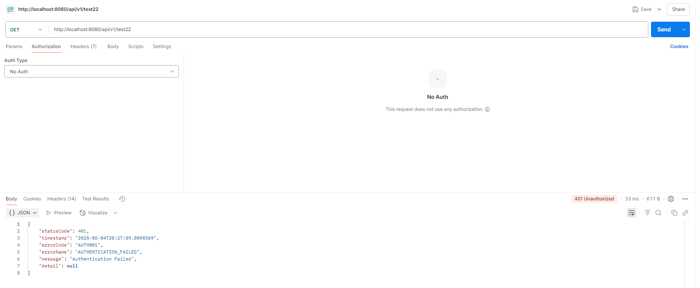

# 요청을 보낸 회원 ID 가져오기

Description: Spring Security에서 요청을 보낸 회원의 ID가 SecurityContextHolder에 담겨 있는데, 여기서 회원 ID를 꺼내오는 방법을 정의
Tag: OAuth 2.0, Spring Security
Writer: PGD

# 버전 히스토리

| 버전 | 업데이트일시 (KST) | 설명 |
| --- | --- | --- |
| v1 | 2025-05-04 20:04 | 히스토리 기록 시작 |

# 개요

Spring Security를 사용할 때, 요청의 인증 정보는 `SecurityContext` 객체에 담깁니다. 이 문서에서는 `SecurityContext` 객체에 들어 있는 인증 정보를 꺼내오는 방법과, `SecurityContext` 객체에 어떤 정보가 포함되어 있는지에 대해서 명세합니다.

# 인증 정보 꺼내오기

`SecurityContext`는 `SecurityContextHolder`에 담기는데, `SecurityContextHolder`에 담긴 데이터는 같은 쓰레드 내에서 공유됩니다. Servlet에서는 하나의 요청당 하나의 쓰레드가 할당되고 각 요청이 (새로운 쓰레드를 생성하지 않는 한) 단일 쓰레드 내에서 처리되기 때문에 인증 정보를 특정 객체에 담아 파라미터로 전달하지 않더라도 `SecurityContextHolder`에서 `SecurityContext` 객체를 꺼내 그 안에 들어 있는 인증 정보를 사용할 수 있습니다. 이에 두 가지 방법이 있습니다.

## `SecurityContextHolder`에서 직접 꺼내기

`SecurityContextHolder`에는 `getContext()`라는 static 메소드가 있습니다. 이 메소드를 활용해서 Thread-local에 저장된 `SecurityContext` 객체를 가져올 수 있습니다. 예시 코드는 아래와 같습니다.

```java
package com.codezerotoone.mvp.domain;

import org.springframework.security.core.Authentication;
import org.springframework.security.core.context.SecurityContext;
import org.springframework.security.core.context.SecurityContextHolder;
import org.springframework.web.bind.annotation.GetMapping;
import org.springframework.web.bind.annotation.RequestMapping;
import org.springframework.web.bind.annotation.RestController;

@RestController
@RequestMapping("/api/v1/test22")
public class TestController {

    @GetMapping
    public String test() {
        SecurityContext context = SecurityContextHolder.getContext();
        Authentication authentication = context.getAuthentication();
        String memberId = authentication.getName();
        return memberId;
    }
}
```

이를 테스트하기 위해서 먼저 `member` 엔티티를 삽입합니다.

```json
{
  "member_id": 1,
  "created_at": "2025-05-04 20:24:28.000000",
  "updated_at": "2025-05-04 20:24:32.000000",
  "auto_matching": "F",
  "deleted_at": null,
  "login_id": null,
  "member_status": "ACTIVE",
  "name": "안유진",
  "oidc_id": "123",
  "role_id": "ROLE_MEMBER"
}
```

`member` 테이블에 저장된 데이터를 JSON 형식으로 추출한 것입니다. `oidc_id`가 `123`이므로 JSON 토큰 값은 다음과 같습니다:

`{"id":"123"}`

우선 Credential 없이 요청을 보내 봅시다.



401이 나오죠. 그러면 Bearer Token으로 JSON 토큰 값을 넣어서 요청을 보내 보겠습니다.


응답으로 `1`이 나오죠. 즉, `SecurityContextHolder` → `SecurityContext` → `Authentication` 순으로 꺼낸 `Authentication` 객체의 `name` 필드가 회원 ID를 가리킨다는 점을 알 수 있습니다.

## 컨트롤러에서 `AuthenticationPrincipal` 어노테이션으로 Principal 객체에 접근하기

Principal 객체는 Java 진영의 security API에서 사용하는 용어로, Credential 정보를 제출하는 주체를 가리킵니다. 즉, 요청을 보내는 회원이라고 볼 수 있습니다. Principal 객체는 이름 (ID), Credentials와 같은 인증 정보와 여러 속성을 가지고 있습니다. 그래서 Principal 객체에 접근할 수 있다면 이 객체가 가지고 있는 인증 정보와 요청 주체와 관련된 여러 속성을 추출하여 활용할 수 있게 되는 것입니다.

Principal 객체는 `Authentication` 객체가 가지고 있습니다. `Authentication` 객체는 상기된 바와 같이 `SecurityContext`에서 꺼내올 수 있습니다. `Authentication.getPrincipal()` 메소드를 통해 Principal객체를 꺼낼 수 있는데, 이 메소드의 리턴 타입이 `Object`입니다. 이는 `Authentication` 객체에 담기는 Principal 객체의 타입이 확실히 정해진 바가 없기 때문…이라고 생각합니다. 아님 말고.

저희 프로젝트에서는 Principal 객체로 `OAuth2AuthenticatedPrincipal` 인터페이스의 구현체를 사용하고 있습니다. `OAuth2AuthenticatedPrincipal` 인터페이스는 `AuthenticatedPrincipal` 인터페이스를 확장하고 있고요. 먼저 `AuthenticatedPrincipal` 인터페이스를 보겠습니다.


`org.springframework.security.core` 패키지 아래에 있으며, `getName()` 메소드를 정의하는 것을 확인할 수 있습니다. 여기서 눈여겨보실 점은 `AuthenticatedPrincipal` 인터페이스는 어떤 인터페이스도 확장하고 있지 않다는 것입니다. 그 다음으로 `OAuth2AuthenticatedPrincipal` 인터페이스를 보겠습니다.


세 가지 메소드를 추가로 정의하고 있습니다. 여기에 `AuthenticatedPrincipal` 인터페이스의 `getName()` 메소드를 추가로 가지고 있을 것입니다. 여기서 `getAttribute()` 메소드를 통해 Principal 객체에 저장된 속성을 가져올 수 있습니다.

위 사실을 코드로 확인해 보겠습니다.

```java
@RestController
@RequestMapping("/api/v1/test22")
public class TestController {

    @GetMapping
    public String test() {
        SecurityContext context = SecurityContextHolder.getContext();
        Authentication authentication = context.getAuthentication();
        OAuth2AuthenticatedPrincipal principal = (OAuth2AuthenticatedPrincipal) authentication.getPrincipal();
        String memberId = principal.getName();
        return memberId;
    }
}
```


`memberId`가 잘 오고 있습니다.

그런데 **Spring MVC의 Controller에서 어노테이션을 이용해 `OAuth2AuthenticatedPrincipal 객체를 파라미터로 받을 수 있습니다**. 바로 코드로 보여드리겠습니다.

```java
@RestController
@RequestMapping("/api/v1/test22")
public class TestController {

    @GetMapping
    public String test(@AuthenticationPrincipal OAuth2AuthenticatedPrincipal principal) {
        String memberId = principal.getName();
        return memberId;
    }
}
```

코드의 양이 확 줄었습니다.


잘 되죠.

## Principal에 담긴 속성

현재 (문서 버전 v1) 우리가 Principal 객체에서 꺼내올 만한 데이터는 세 가지입니다. - `memberId`, `oidcId`, `role`

`OAuth2AuthenticatedPrincipal` 객체에 위 세 가지 정보를 담는 코드는 `DefaultOpaqueTokenIntrospector` 클래스에 있습니다.


여기서 36 ~ 40번 라인, 그리고 45 ~ 49번 라인에 주목해 주시길 바랍니다. `DefaultOAuth2AuthenticatedPrincpal` 생성자에 회원 ID (String 형태), `Map` 객체, `SimpleGrantedAuthority` 객체 List가 전달되는 것을 확인할 수 있습니다. `DefaultOAuth2AuthenticatedPrincipal` 생성자 Javadoc은 다음과 같습니다.


`name`은 요청 주체의 이름 (회원 ID), `atribute`는 속성, `authorities`는 회원의 권한을 나타냅니다. 이 안에 들어 있는 정보들을 추출해 보겠습니다.

테스트할 샘플 컨트롤러 코드는 다음과 같습니다.

```java
@RestController
@RequestMapping("/api/v1/test22")
@Slf4j
public class TestController {

    @GetMapping
    public String test(@AuthenticationPrincipal OAuth2AuthenticatedPrincipal principal) {
        log.info("principal: {}", principal);
        log.info("principal.getName(): {}", principal.getName());
        log.info("principal.getAuthorities(): {}", principal.getAuthorities());
        log.info("principal.getAttributes(): {}", principal.getAttributes());
        log.info("principal.getAttribute(\"sub\"): {}", (String) principal.getAttribute("sub"));
        return "Hello, World!";
    }
}
```

요청을 보낸 후 콘솔 찍어 보겠습니다.


위 콘솔을 보면 이해가 잘 가실 겁니다. `sub`은 `oidcId`입니다.

## 주의사항

`SecurityContextHolder`, `OAuth2AuthenticationPrincipal` 등은 Spring Security 기술이고, **변할 수 있는 것**입니다. 이 때문에 **Service 객체에 Spring Security 기술을 노출시켜서는 안 됩니다**. 왜냐하면 Service 객체는 비즈니스 로직을 가지고 있는 Application 코드이고, 비즈니스 로직 코드는 요구사항이 변경될 경우를 제외하고 변경되어서는 안 됩니다. 다시 말해, 비즈니스 로직 코드는 외부 기술에 의존해서는 안 된다는 것입니다. Service 객체 안에서 `SecurityContextHolder`에 접근하여 `Authentication` 객체를 꺼내는 코드를 작성한다면 그 Service 객체는 Spring Security라는 기술에 종속됩니다. 웬만하면 계속 Spring Security를 사용하겠지만, 그래도 Spring Security가 아닌 다른 기술을 사용하게 되었다고 가정해 봅시다. 그러면 Spring Security에 종속된 Service 객체의 코드 변경 없이 Spring Security를 대체할 수 없게 됩니다. 저희 프로젝트 규모가 더 커져서 막 코드가 10만 줄이 넘어가는데, Application 코드 곳곳에 Spring Security에 대한 의존성이 발견된다고 합시다. 그러면 이 프로젝트는 최후의 순간까지 Spring Security를 사용해야 합니다. 더 개쩌는 기술이 나온다고 하더라도요.