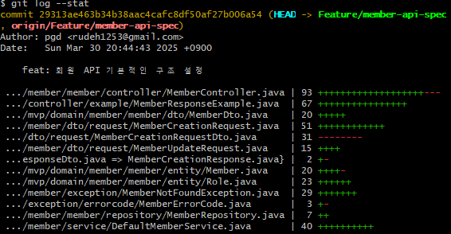
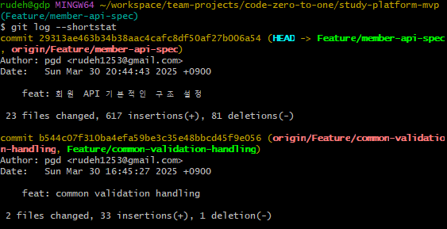

# Git 컨벤션

Description: Git 컨벤션
Tag: 컨벤션
Writer: PGD

# 버전 히스토리

| 버전 | 업데이트일시 (KST) | 설명 |
| --- | --- | --- |
| v1 | 2025-04-26 12:26 | 히스토리 기록 시작 |
| v2 | 2025-05-06 21:07 | 브랜치 이름 컨벤션 작성 |

# 개요

저희가 이미 어느 정도 정해진 커밋 룰이 있고, 협업 방식이 있지만, 이렇게 문서를 통해 커밋 룰을 명확히 하고, 이를 바탕으로 문서화하고자 이렇게 이슈를 만들게 되었습니다.

# 설명

## 커밋 메시지

커밋은 작성 코드를 파악할 수 있도록 잘게 나누어 자주 올리고 커밋제목만 봐도 코드를 유추할 수 있도록 작성합니다.

### 커밋 메시지 포맷

```
<type>(<scope>): <subject> - Subject line
<BLANK LINE>               - 줄 바꿈으로 구분한다
<body>                     - Message body
<BLANK LINE>
<footer>                   - Message footer

```

- Subject line
    - 변경사항에 대한 간단한 설명
    - 70자를 넘기지 않도록 합니다.
    - 마침표 사용 금지
    - type에 대해서는 아래 type 컨벤션을 확인해 주세요.
    - scope는 해당 커밋의 범위를 나타냅니다. 예를 들어 `MemberController`를 수정했으면 scope에 `MemberController`가 올 수 있습니다. scope에는 꼭 파일명이 올 필요는 없고, 해당 커밋의 범위를 나타낼 수 있는 건 무엇이든 올 수 있습니다. scope은 선택사항입니다.
- Message body
    - 수정 이유와 전후 비교 설명
    - 명령형 현재 시제로 작성합니다. (changed X, change O)
    - 영어를 사용해도 되고 한국어를 사용해도 좋습니다.
    - 70자를 넘기면 줄바꿈합니다.
    - 선택사항
- Message Footer
    - 주요 변경사항을 푸터에 변화에 대한 상세설명, 정의, 이전 노트와 함께 명시되어야 합니다.
    - 전후를 Before: scope { ~~ } After: scope { ~~~ }와 같이 상세하게 명시합니다.
    - 처리가 완료된, 즉 close된 이슈에 대해서는 `Closes #123, #124`로 표기합니다.
    - 관련된 이슈는 `Related to: #123`과 같이 표기할 수 있습니다.

### type 컨벤션

| type | when |
| --- | --- |
| feat | 기능을 추가한 경우 |
| fix | 버그를 수정한 경우 |
| docs | 문서 작업을 한 경우 (코드 내의 문서 작업을 한 경우도 포함 됩니다 - ex: Springdocs, Javadocs) |
| style | 코딩 스타일을 변경한 경우 (indentation, line wrapping, 띄어쓰기 등등) |
| refactor | 리팩토링을 수행한 경우 |
| chore | 빌드 스크립트 작업, 환경설정 등 (feat이나 refactor로 나타내기 애매한 것은 chore로 명시하면 됩니다) |

### 예시

**기능 구현**

```
feat($browser): onUrlChange event (popstate/hashchange/polling)

Added new event to $browser:
- forward popstate event if available
- forward hashchange event if popstate not available
- do polling when neither popstate nor hashchange available

Breaks $browser.onHashChange, which was removed (use onUrlChange instead)

```

**버그 수정**

```
feat(directive): ng:disabled, ng:checked, ng:multiple, ng:readonly, ng:selected

New directives for proper binding these attributes in older browsers (IE).
Added coresponding description, live examples and e2e tests.

Closes #351

```

## Pull Request

PR은 기능 단위로 작업하며, PR 제목만 봐도 작업 내용을 유추할 수 있도록 작성합니다.

### Rule

- 하나의 PR에서 작업한 코드의 라인 수는 1000줄을 넘기지 않도록 합니다.
- PR에 대해 한 명 이상의 리뷰어가 Approve해야 PR을 머지할 수 있습니다.
- HOTFIX의 경우 예외적으로 리뷰 없이 머지할 수 있습니다.
- Asignees와 Labels를 지정합니다. (권장사항)
- PR은 반드시 PR Asignees가 머지합니다 (리뷰어가 머지 버튼 누르기 금지).
- Approve가 난 이후 PR에 수정사항이 발생한 경우 (추가 커밋 등) 다시 Approve를 한 개 이상 받아야 합니다.
- PR을 머지하기 전에 테스트 코드를 돌리고 모든 테스트가 완벽히 통과하는지 확인합니다.
- PR로 올라간 코드를 PR을 올린 사람이 아닌 다른 사람이 사용해야 해서 해당 PR의 브랜치를 pull받을 수 있습니다. 이때 rebase를 사용한 경우, PR을 올린 사람에게 꼭 통보합니다.
- PR을 머지한 이후 브랜치를 삭제합니다.

## PR 템플릿

PR 템플릿은 다음을 따릅니다. (곧 PR 템플릿도 적용시키면 좋겠습니다.)

**제목**
<type>: <PR 제목>

ex) feat: 회원 관리 기능 구현

**본문**

```
# 개요
회원 관리 기능을 구현했다.

# 설명
회원 관리 기능을 이렇게 한 이유는, 저런 효과가 있기 때문에 성능적 이점을 가져오기 위해 이렇게 했다.

# 참고사항
김영한 스프링

```

본문의 설명 부분에는 how도 충분히 설명하면 좋지만, how보다 why에 중점을 둡니다.

## PR이 머지되기 전에 추가 작업을 할 경우

PR을 올린 후 또 작업을 하고자 합니다. 그런데 추가적으로 작업을 하려고 하니 추가 작업이 PR로 올라간 코드에 대해 의존성을 가지고 있습니다. 그런데 그 PR에 커밋을 추가할 경우, PR의 덩치가 너무 커질 것 같습니다.

이러한 경우, 다음과 같이 작업하면 되겠습니다.

### Case 1: 기존 PR을 머지하지 않은 상태로 추가 작업을 하고, 새 PR을 올릴 경우

1. PR이 올라간 브랜치에서 새로 브랜치를 판다.
2. 거기서 작업한다.
3. 작업 후 새 PR을 올린다.
4. 새 PR을 올릴 때, base 브랜치를 기존 PR로 설정한다. (i.e., 기존 PR이 있고 새 PR이 있으면, 새 PR을 올릴 때 기존 PR로 머지가 되도록 설정합니다)
5. 모든 PR에 대한 리뷰가 끝날 경우, PR이 올라간 순서의 역순으로 머지를 진행한다.

예를 들어 PR1이 먼저 올라간 상태고, PR1에서 새 브랜치를 만들어 PR2를 올리고, 이렇게 PR3, PR4, ...를 만들었을 경우, 머지할 때 PR4 -> PR3, PR3 -> PR2, PR2 -> PR1, PR1 -> dev 이런 순서로 머지를 진행하시면 되겠습니ㅏㄷ.

### Case 2: 기존 PR에서 새 브랜치를 파고 작업하다가 기존 PR이 머지된 경우

이 경우 rebase를 하면 됩니다.

# 참고사항

## 커밋 작업량 확인

`git log` 커맨드의 `--stat` 옵션을 붙임으로써 커밋의 작업량을 확인할 수 있습니다.



혹은 `--shortstat` 옵션을 붙임으로써 파일에 상관없이 각 커밋에서 발생한 작업량만 확인할 수 있습니다.



# 브랜치 네임 컨벤션

브랜치 이름은 `<Jira 이슈 번호>/<작업 내용>`입니다.

ex) `QNRR-127/member-api-documents`

추신) 컴퓨터는 한글을 싫어합니다.